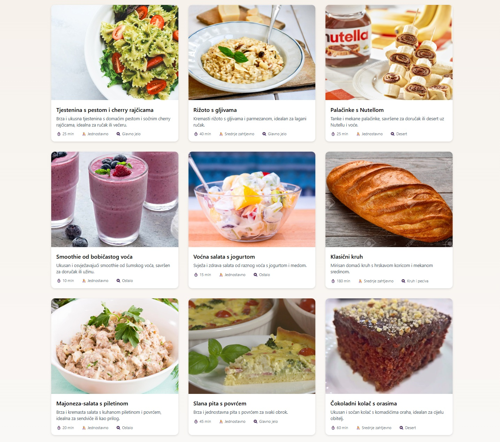

### 🧑‍🍳 Coolinarika Mini Clone

**Coolinarika Mini Clone** is a high-performance, SEO-optimized recipe platform built with **Next.js (App Router)**, **Prisma**, and **SQLite**.
It replicates the core experience of Coolinarika, allowing users to browse recipes, view detailed recipe pages, and provides a fully functional backend exposing RESTful CRUD API endpoints for managing recipes.

The project demonstrates modern **full-stack Next.js best practices**, focusing on:

- **Clean architecture**: separation of domain, API, UI, and utilities

- **Performance & speed**: Incremental Static Regeneration (ISR) with 60-second revalidation for fast initial load and near-real-time content updates.

- **SEO optimization**: dynamic metadata, structured data (JSON-LD), and clean URLs

- **CDN simulation**: serving hero images with cache-friendly headers

- **Scalability & maintainability**: modular structure to extend features easily

This mini clone showcases a professional, production-ready pattern commonly used in modern web applications, balancing performance, usability, and maintainability.

---

## 🛠️ Technologies Used

- **Next.js (App Router)** – Full-stack React framework with ISR (Incremental Static Regeneration)

- **TypeScript** – Type-safe development

- **Prisma** – Type-safe ORM

- **SQLite** – Lightweight database for development

- **Tailwind CSS** – Utility-first styling

- **Next.js API Routes** – Backend logic for CRUD operations

- **SEO & JSON-LD** – Structured metadata for recipe pages

---

## Demo / Screenshot



---

## 🗂️ Project Structure

<!-- START_FOLDER_STRUCTURE -->

```bash
.
├── app
│   ├── api
│   │   ├── cdn
│   │   │   └── [...path]/route.ts          # CDN proxy route serving hero images
│   │   └── recipes
│   │       ├── [slugAndId]/route.ts        # Single recipe API (GET, PUT, DELETE)
│   │       └── route.ts                    # Recipe list API (GET, POST)
│   ├── recepti
│   │   ├── [slugAndId]/page.tsx            # Single recipe detail page
│   │   └── page.tsx                        # Recipe list page (/recepti)
│   ├── page.tsx                            # Root page redirects to /recepti
│   ├── layout.tsx                          # App layout & global wrappers
│   └── globals.css                         # Global styles
│
├── components
│   ├── Recipe/RecipeCard.tsx               # Recipe card UI component
│   └── Seo/Seo.tsx                         # SEO wrapper component
│
├── domain/recipe.ts                        # Recipe domain model & TypeScript types
│
├── lib
│   ├── api/recipeService.ts                # Frontend calls to backend API
│   ├── db/prismaClient.ts                  # Prisma client initialization
│   ├── helpers                             # Shared utility functions
│   │   ├── extractId.ts
│   │   ├── slugify.ts
│   │   ├── serialize.ts
│   │   └── validation.ts
│   ├── maps/displayMaps.ts                 # Mapping utilities
│   └── seo                                 # Metadata & JSON-LD generators
│       ├── homePageMetaData.ts
│       ├── homepageJsonLd.ts
│       ├── recipeJsonLd.ts
│       ├── recipeMetadata.ts
│       ├── rootJsonLd.ts
│       └── rootMetadata.ts
│
├── prisma
│   ├── schema.prisma                        # Prisma schema
│   ├── seed/recipes.ts                      # Seed data for initial recipes
│   └── dev.db                               # SQLite database
│
├── public
│   ├── cdn/recipes/...                      # Hero images stored per recipe slug
│   └── screenshot.jpg                       # Local screenshot for README
│
├── README.md
├── eslint.config.mjs
├── next.config.ts                            # Next.js config including CDN cache headers
├── package-lock.json
├── package.json
├── postcss.config.mjs
└── tsconfig.json
```

<!-- END_FOLDER_STRUCTURE -->

---

### ⚡ Features

## User Features

- Browse recipes in a clean list/grid layout

- View detailed recipe pages with hero image, ingredients, steps, and tags

- Fast page loads via server-side rendering (ISR)

- Clean, shareable URLs (/recept/[slugAndId])

- Hero images served via /api/cdn/\* with immutable caching headers

---

## Backend Features

- Fully functional CRUD API for recipes

- Unique, stable slug identifiers for recipes

- Input validation and structured error responses (400/404/409)

- Prisma ORM with seed data for easy development

---

## Technical Highlights

- Layered Architecture: domain, lib, components, app routes separated

- SEO: Metadata + JSON-LD for homepage and recipes

- Performance: ISR, caching, CDN simulation

- Reusable Components: RecipeCard, Seo wrapper

- Utilities: slugify, serialize, validation helpers

---

### ⚙️ Installation & Setup

## 1️⃣ Clone & Install

```bash
git clone https://github.com/agaribovic/coolinarika-mini-clone.git
cd coolinarika-mini-clone
npm install
```

---

## 2️⃣ Environment Variables

Create a .env file with the following variables:

```bash
DATABASE_URL="file:./dev.db"
NEXT_PUBLIC_BASE_URL="http://localhost:3000"
NEXT_PUBLIC_CDN_BASE_URL="http://localhost:3000/api/cdn"
```

## 3️⃣ Setup Database

```bash
prisma generate
npx prisma db seed
```

## 4️⃣ Start Development Server

```bash
npm run dev
```

App runs at: http://localhost:3000

---

## 🛣️ API Endpoints

| Endpoint                         | Method | Description                           |
| -------------------------------- | ------ | ------------------------------------- |
| /api/recipes                     | GET    | Fetch list of recipes                 |
| /api/recipes/[slugAndId]         | GET    | Fetch single recipe details           |
| /api/recipes                     | POST   | Create a new recipe                   |
| /api/recipes/[slugAndId]         | PUT    | Update a recipe                       |
| /api/recipes/[slugAndId]         | DELETE | Delete a recipe                       |
| /api/cdn/recipes/[slug]/hero.jpg | GET    | Serve hero image with immutable cache |

---

## 🧠 Architecture Notes

- **Domain-Driven Design**: All business logic is isolated in domain/recipe.ts

- **API Layer**: Frontend interacts with lib/api/recipeService.ts, never directly with DB

- **SEO Layer**: Metadata + JSON-LD separated from UI

- **CDN Simulation**: Hero images served through /api/cdn/\* with proper caching headers

- **ISR & Performance**: Pages are statically generated and served from cache, with automatic revalidation every 60 seconds for fast load times and SEO-friendly content.

---

## 🌟 Future Improvements

- Search and filtering by tags, categories, and difficulty

- Infinite scroll or pagination on recipe lists

- Multiple hero images per recipe

- Real CDN integration (Cloudflare R2, Supabase Storage, etc.)

- User authentication and favorites

- Advanced analytics, structured data enhancements

- OpenGraph images for social sharing
